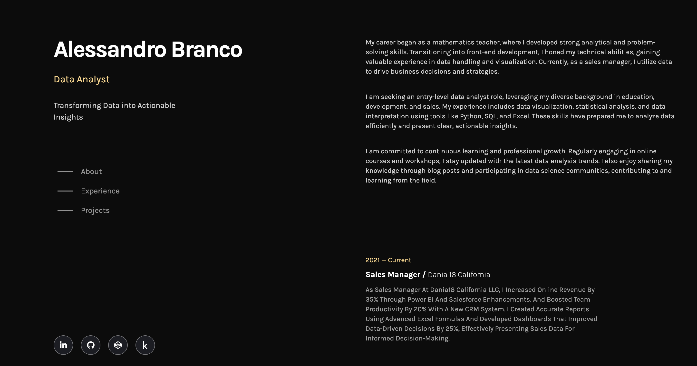

# Alessandro Branco Portfolio



Welcome to my portfolio! This repository showcases a collection of my projects demonstrating my skills in data analysis, visualization, and problem-solving. My diverse background in mathematics, front-end development, and sales management allows me to bring a unique perspective to data-driven decision-making.

## About Me

I am a motivated and detail-oriented data analyst with a solid foundation in mathematics and experience in front-end development and sales management. My current role as a Sales Manager has sharpened my analytical skills, enabling me to dissect sales data, uncover trends, and generate actionable insights that drive business growth. I am passionate about leveraging data to solve complex problems and guide strategic decisions.

## Skills

- **Programming Languages:** Python, R
- **Data Analysis:** Pandas, NumPy, SQL
- **Data Visualization:** Matplotlib, Seaborn, Tableau
- **Machine Learning:** Scikit-learn
- **Databases:** MySQL, PostgreSQL
- **Tools:** Excel, Jupyter Notebooks, VSCode, GitHub
- **Web Development:** HTML, CSS, Bootstrap, Tailwind, JavaScript, React

## Projects

### 1. Analyzing Students' Mental Health
- **Description:** This project involves exploring and analyzing data from a study on international students to understand how their length of stay impacts their average mental health diagnostic scores. The study includes three diagnostic scores: PHQ-9 (todep), SCS (tosc), and ASISS (toas).
- **Technologies Used:** Python, Pandas, Matplotlib, Seaborn

### 2. Motorcycle Parts Sales Analysis
- **Description:** This project analyzes sales data for a company selling motorcycle parts across three warehouses in retail and wholesale markets. It focuses on understanding wholesale revenue by product line, examining monthly variations and differences across warehouses.
- **Technologies Used:** Python, Scikit-learn, Seaborn

### 3. What and Where are the World's Oldest Businesses
- **Description:** This project explores data from BusinessFinancing.co.uk on the world's oldest businesses to understand their longevity and resilience in changing market conditions. By analyzing founding dates and industries, we uncover insights into historical contexts and survival factors.

## How to Use This Repository

1. Clone the repository:
   ```bash
   git clone https://github.com/abranco0403/Personal-Portfolio.git

Thank you for visiting my portfolio!
